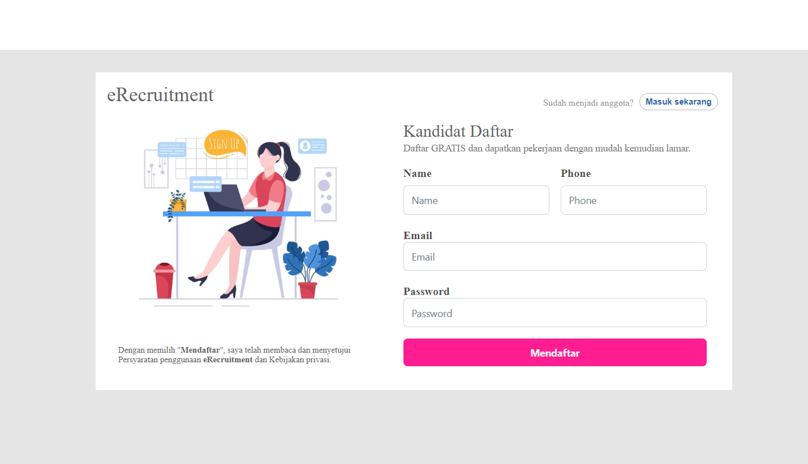
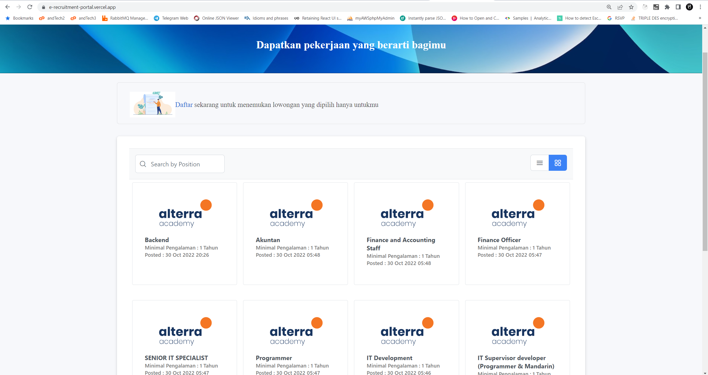
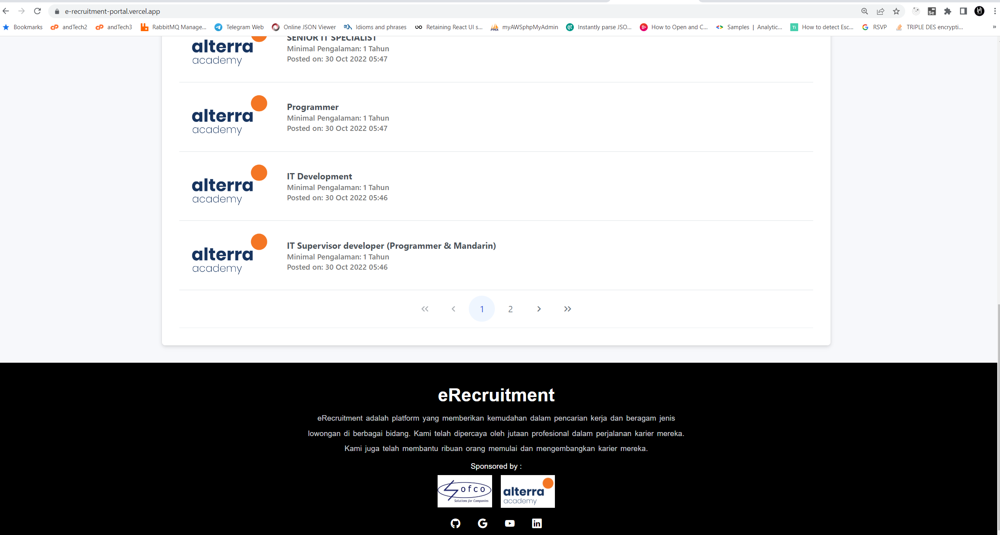
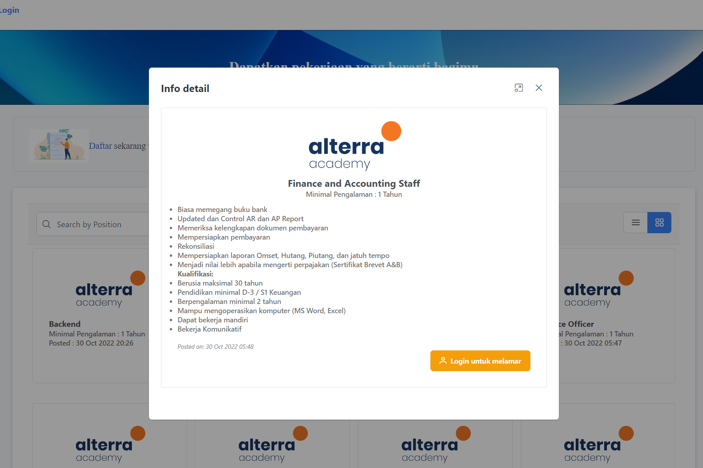

# eRecruitment - Portal

## Key Activities

### **Pelamar**

1. Signup ke situs Loker.
2. Mengajukan lamaran ke posisi/jabatan yang diinginkan dan memasukkan data diri serta data lain yang dibutuhkan.
3. Menerima informasi hasil lulus atau tidaknya dalam proses test.

## Arsitektur & Fitur

- Angular, PrimeNG, PrimeFlex.
- Backend API on this repo : https://github.com/alterra-sofco/e-recruitment.git
- Pagination - server side.
- Interceptor
- Guard

## How to install on local

1. Pull this repo.
2. Install all dependecies.
3. Set endpoint API on environment
4. Run : <pre>ng serve</pre>
5. Open browser and enter this <a href="http://localhost:4200">url http://localhost:4200 </a>

## Deployment

You can access on url : https://e-recruitment-portal.vercel.app/
<pre>
Login :
email :  pelamar7@mail.com
password : 123456
</pre>

## Preview

### Register

### Login

### Home

 

### Info lowongan detail

